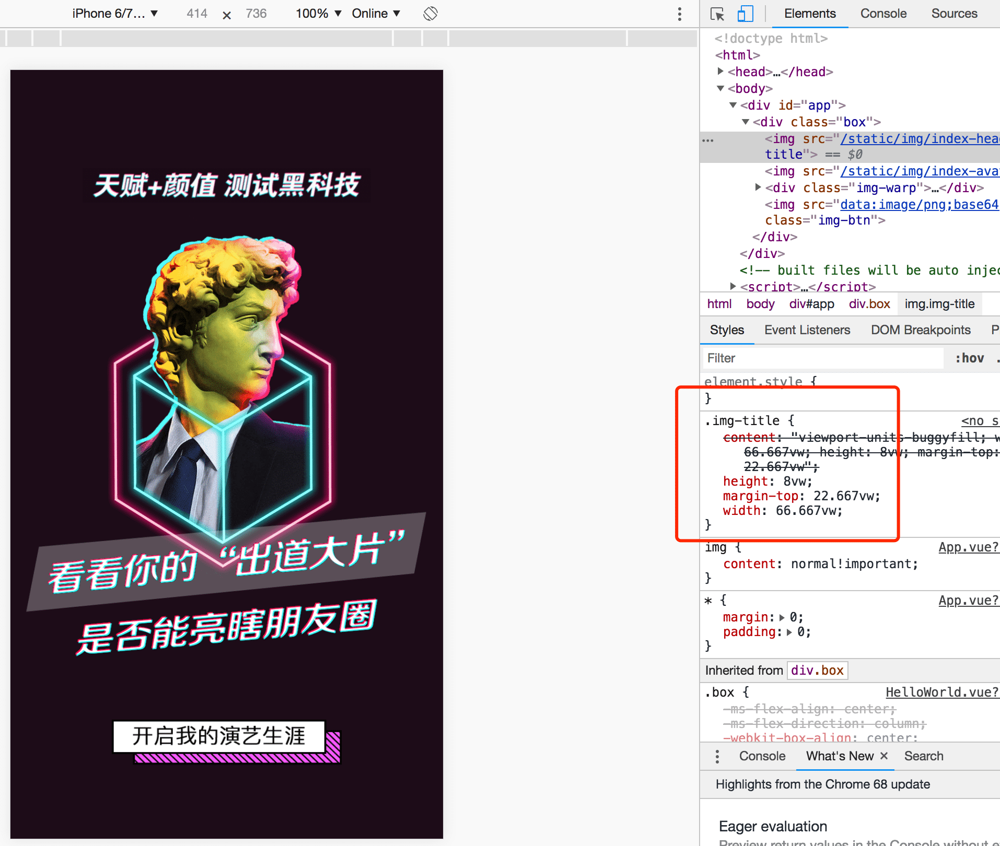
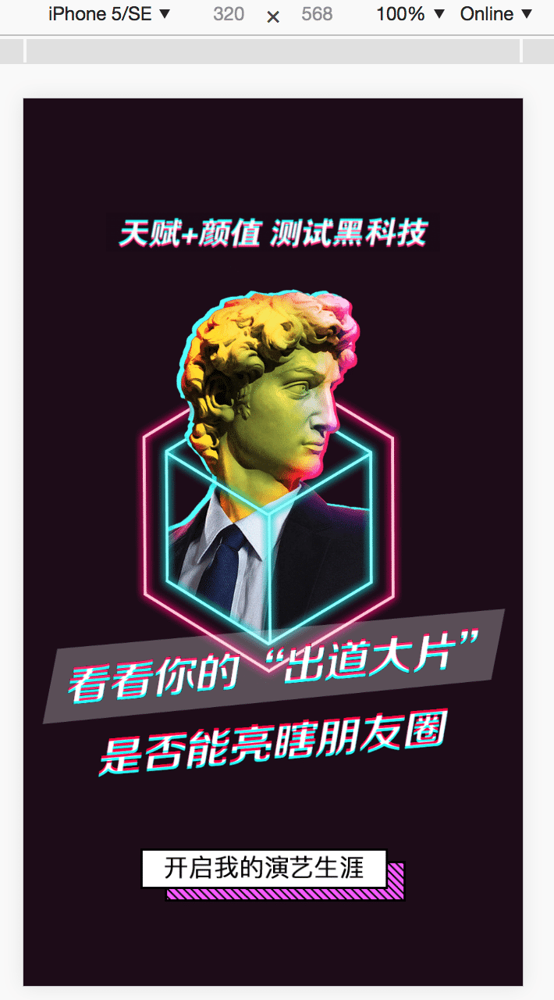
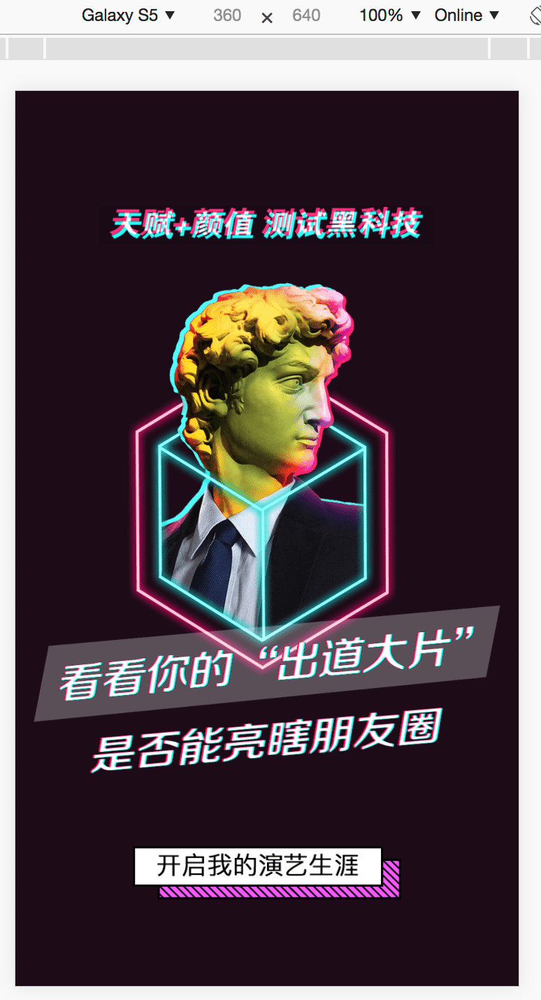

## vue 移动端适配方案

- master分支： 使用淘宝的 `flexible` 进行移动端适配
- vm 分支： 使用vm 进行移动端适配方案

### 使用 vw 适配方案

参考文章：</br>
[如何在Vue项目中使用vw实现移动端适配](https://www.w3cplus.com/mobile/vw-layout-in-vue.html)</br>
[再聊移动端页面的适配](https://www.w3cplus.com/css/vw-for-layout.html)

 vw效果 </br>





1. 通过 vue-cli 构建的项目，在项目根目录下有一个 .postcssrc.js，默认已经有了
```javascript
module.exports = { 
  "plugins": { 
    "postcss-import": {},
    "postcss-url": {},
    "autoprefixer": {}
  } 
}
```
2. 安装插件：</br>
  Vue-cli默认配置了上述三个PostCSS插件，但我们要完成vw的布局兼容方案，或者说让我们能更专心的撸码，还需要配置下面的几个PostCSS插件：
  - postcss-aspect-ratio-mini
  - postcss-px-to-viewport
  - postcss-write-svg
  - postcss-cssnext
  - postcss-viewport-units
  - cssnano
```
npm i postcss-aspect-ratio-mini postcss-px-to-viewport postcss-write-svg postcss-cssnext postcss-viewport-units cssnano --save
```

3. 在 `.postcssrc.js`文件中对新安装的 `PostCSS` 插件进行配置：
```javascript
module.exports = {
  "plugins": {
    "postcss-import": {},
    "postcss-url": {},
    "postcss-aspect-ratio-mini": {},
    "postcss-write-svg": {
      utf8: false
    },
    "postcss-cssnext": {},
    "postcss-px-to-viewport": {
      viewportWidth: 750,   // 视窗的宽度，对应的是我们设计稿的宽度，一般是750
      viewportHeight: 1334, // 视窗的高度，根据750设备的宽度来指定，一般指定1334，也可以不配置
      unitPrecision: 3,     // 指定`px`转换为视窗单位值的小数位数
      viewportUnit: "vw",   //指定需要转换成的视窗单位，建议使用vw
      selectorBlackList: ['.ignore', '.hairlines'],// 指定不转换为视窗单位的类，可以自定义，可以无限添加,建议定义一至两个通用的类名
      minPixelValue: 1,     // 小于或等于`1px`不转换为视窗单位，你也可以设置为你想要的值
      mediaQuery: false     // 允许在媒体查询中转换`px`
    },
    "postcss-viewport-units": {},
    "cssnano": {
      preset: "advanced",
      autoprefixer: false,
      "postcss-zindex": false
    }
  }
}
```
> **【注意】**: 因为 `cssnano` 的配置中，使用了preset: "advanced"，所以我们需要另外安装：
```
npm i cssnano-preset-advanced --save-dev
```

目前出视觉设计稿，我们都是使用750px宽度的，那么100vw = 750px，即1vw = 7.5px。那么我们可以根据设计图上的px值直接转换成对应的vw值。在实际撸码过程，不需要进行任何的计算，直接在代码中写px，比如：
```css
  .test {
    border: .5px solid black;
    border-bottom-width: 4px;
    font-size: 14px;
    line-height: 20px;
    position: relative;
  }
  [w-188-246] {
    width: 188px;
  }
```
编译出来的CSS：
```css
  .test {
    border: .5px solid #000;
    border-bottom-width: .533vw;
    font-size: 1.867vw;
    line-height: 2.667vw;
    position: relative; 
  } 
  [w-188-246] { 
    width: 25.067vw; 
  }
```
在不想要把px转换为vw的时候，首先在对应的元素（html）中添加配置中指定的类名.ignore或.hairlines(.hairlines一般用于设置border-width:0.5px的元素中)：
```html
 <div class="box ignore"></div>
```
其余具体使用，请查看 [文章](https://www.w3cplus.com/mobile/vw-layout-in-vue.html)
