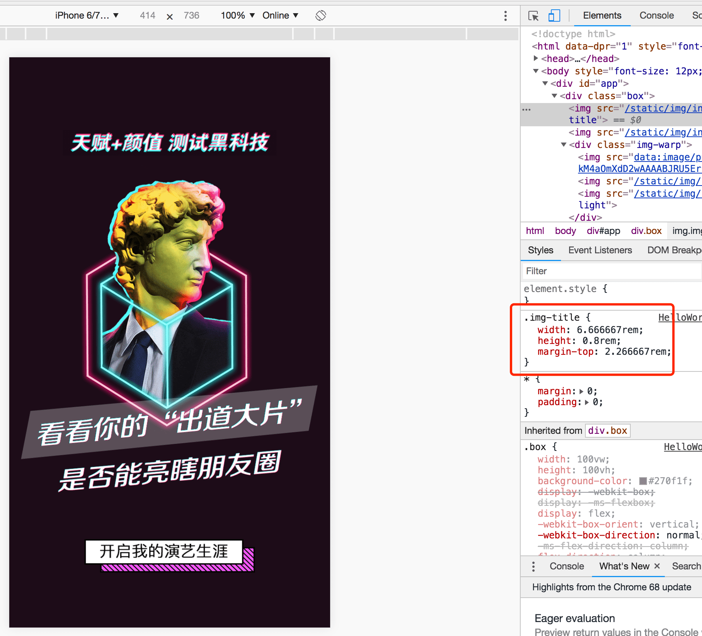
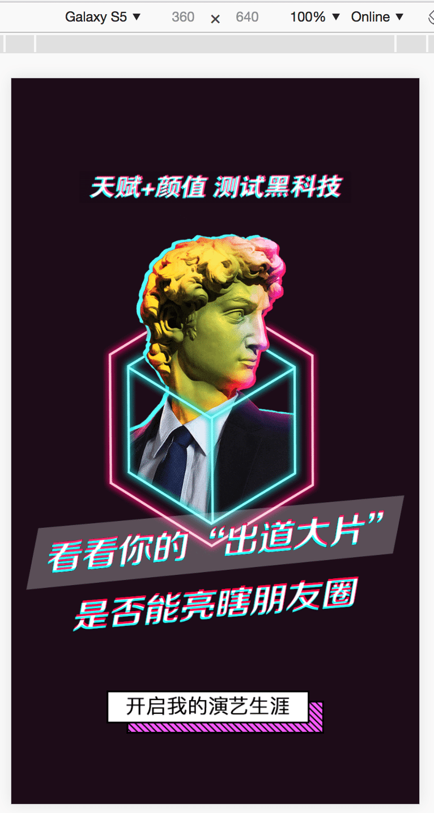

## vue 移动端适配方案

- master分支： 使用淘宝的 `flexible` 进行移动端适配
- vm 分支： 使用vm 进行移动端适配方案

### 阿里可伸缩布局方案 `lib-flexible`

- flexible 示例 </br>




1. 使用 `vue-cli` 初始化一个项目

2. 安装 `lib-flexible` 和 `px2rem-loader`
```
  npm install lib-flexible px2rem-loader --save
```

3. 引入 `lib-flexible`：(在 `mian.js` 中引入)
```javascript
import 'lib-flexible/flexible'
```
4. 配置 `px2rem-loader`：（在项目 `build` 文件下的 `utils.js` 里面修改）
```javascript
  const cssLoader = {
    loader: 'css-loader',
    options: {
      sourceMap: options.sourceMap
    }
  }

  // const postcssLoader = {
  //   loader: 'postcss-loader',
  //   options: {
  //     sourceMap: options.sourceMap
  //   }
  // }

  const px2remLoader = {
    loader: 'px2rem-loader',
    options: {
      remUnit: 75 // 设置转换比例，这里是 1rem === 75px
    }
  } 

 // generate loader string to be used with extract text plugin
  function generateLoaders (loader, loaderOptions) {
    // const loaders = options.usePostCSS ? [cssLoader, postcssLoader] : [cssLoader]
    const loaders = [cssLoader,px2remLoader]
    if (loader) {
      loaders.push({
        loader: loader + '-loader',
        options: Object.assign({}, loaderOptions, {
          sourceMap: options.sourceMap
        })
      })
    }

    // Extract CSS when that option is specified
    // (which is the case during production build)
    if (options.extract) {
      return ExtractTextPlugin.extract({
        use: loaders,
        fallback: 'vue-style-loader'
      })
    } else {
      return ['vue-style-loader'].concat(loaders)
    }
  }
```
5. `px2rem` 用法
- 安装px2rem后，再使用px上有些不同，大家可以参考[px2rem](https://www.npmjs.com/package/px2rem)官方介绍，下面简单介绍一下。

  >1. 直接写px，编译后会直接转化成rem ---- 除开下面两种情况，其他长度用这个
  >2. 在px后面添加/*no*/，不会转化px，会原样输出。 --- 一般border需用这个
  >3. 在px后面添加/*px*/,会根据dpr的不同，生成三套代码。---- 一般字体需用这个 

**示例：**
```css
.selector {
    width: 150px;
    height: 64px; /*px*/
    font-size: 28px; /*px*/
    border: 1px solid #ddd; /*no*/
}
编译后（打包后的代码）
.selector {
    width: 2rem;
    border: 1px solid #ddd;
}
[data-dpr="1"] .selector {
    height: 32px;
    font-size: 14px;
}
[data-dpr="2"] .selector {
    height: 64px;
    font-size: 28px;
}
[data-dpr="3"] .selector {
    height: 96px;
    font-size: 42px;
}
```
